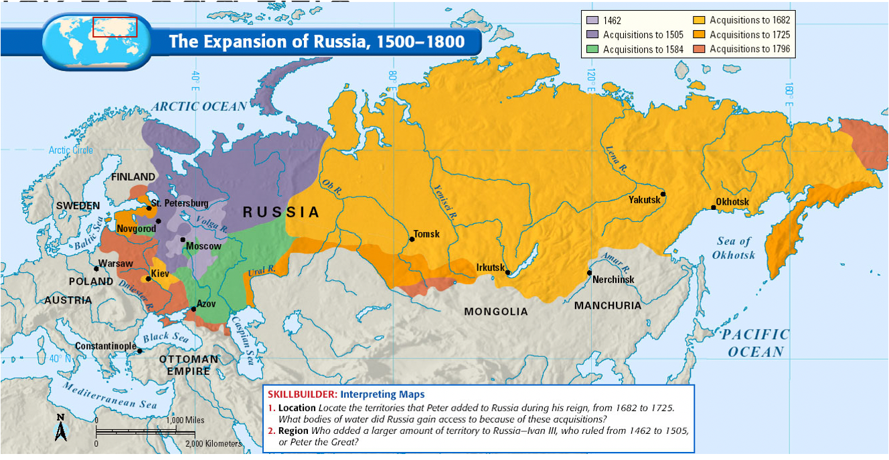
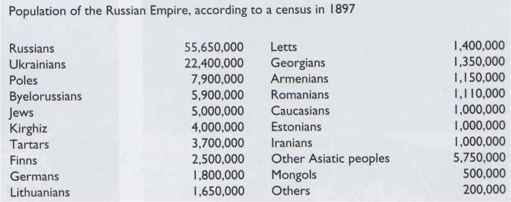

# The Decline and Fall of the Romanovs (PPT 1)

[The Decline and Fall of the Romanov Dynasty Overview. ](Romanov%20Dynasty.md) 

# Focus:

---

>We will focus on the various historical interpretations surrounding the reasons for the fall fo the dynasty. This will include:

→ The autocracy of Tsar Nicholas II.

→ The growth of opposition to the Romanovs.

→ Political, economic and social grievances of the people.

→ The role of the First World War and the downfall of the Romanov dynasty.

→ The transfer of power from the Romanovs to the Provisional Government. 

<aside>
👑 **Fundamental Law of the Empire — Article 1:**  The Emperor of all the Russias is an autocratic and unlimited monarch. God Himself ordains that all must bow to his supremre power, not only ou tof fear but also out of conscience.

</aside>

## Nature of the Tsar's Rule over his people

---

The Tsar's rule was similar to that of a colony of bees. Without the queen bee the colony would cease to exist and without the Tsar to rule over the Russian people russian society would cease to exist. The Fundamental laws of the Empire established in 1716 and then again in 1832 by Russian Tsars  described the Tsar as being an autocratic monarch with complete political power, not limited by a formal constitution or parliament,  which stated that "God himself commands his(the Tsar) supreme power to be obeyed". All law emanated from the Tsar himself and officials and servants swore an oath of loyalty to the Tsar personally not the state. Essentially a dictatorship but not directly named so due to it being a royal family. The people believed that there was no other way to rule. A symbol of hope in a country where hope was very hard to find. Nicholas II believed Autocracy to be a sacred trust and Russia the dynasty's patrimony to be handed on to his own son intact. 

## Why was this system created and how long had it been in place?

---

Before the founding of the Romanov Dynasty in the early 1600s Russia was a poltically fragmented state, economically and cutlurally underdeveloped characterised by chaotic internal disarray, foreign invaders and rapid succession of rulers Russia needed a system to help pull it back together and thus resulted Tsarism. The House of Romanov and Tsarism in Russia would continue for 304 years from the beginning of Michael Romanov's rule in 1613 to the end of Nicholas II's rule in 1917. 

## Autocracy:

---

A system of government where one person has absolute political power and sovereignty Eg. A King, Emperor or Tsar. Democracy is about the collective everyone votes for a particular person, party or group to be in power whereas in autocracy there is no voting or considering the choice of the public. 

> "I shall adhere as unwaveringly as my father to the principle of autocracy" — Tsar Nicholas II 1894.
> 

The quote above implies that Nicholas II will continute the tradition of autocratic rule in Russia and has no plans to hand over power. 

## Politcally Backwards

---

**Russia was 'politically backwards' compared to other European powers**

→ By the beginning of the 20th Century all major Western European countries had some form of democratic government. 

→ Remained outside the mainstream of European political thought. 

→ Tsar's word remained final on all legal and governmental matters. 

**Extremism was encouraged through the denial of free speech**

→ Alexander II was assasinated in 1891

→ No space for political debate

**The Russian Orthodox Church**

→ Split from other branches of Christianity in the 15th Century

→ Completely independant of outside influence 

→ Expressian of Russian culture

→ Deeply conservative and opposed to political change.

## Late Imperial Russia

---

→ Nicholas II became Tsar in 1894

- Russia was plagued by many long standing difficulties that had prevented it achieving modernity

→ In 1894, Imperial Russia covered over 123 Million Square km

- At its widest 8000km East to WEst and 3,200km North to South
- Spanned across two continents

→ Approx 125 million people lived in Russia

- 100 different ethnicites
- Greater part of the population lived in European Russia

→ An Agrarian Society

- Only 5% of Russia contained suitable farmland.

## Historiography

---

> “The whole mistake of our decades-old policy is that we still have not realised that since the time of Peter the Great and Catherine the Great, there has been no such thing as ‘Russia’. What we have is the Russian Empire. Since 35 per cent of the population consists of alienns and Russians are divided into Great Russians, Little Russians and White Russians, we cannot... conduct a policy which ignores the peculiarities of the other nationalities belonging to the Empire. The watchword of such an empire cannot be ‘Let us turn everyone into genuine Russians’.” — ***Sergei Witte, tsarist minister.***
> 

## Summary

---

→ At the turn of the centurym Russia was a vast empire, spanning one-sixth of the globe and inhabited by more 125 million people. 

→ It was also a land of diverse terrain, from rich farmland to grassy steppe and frozen tundra, as well as significant natural resources. 

→ Russia’s population contained people from more than 100 ethnicities and 120 language groups. Around 45% were of Slavic Heritage. 

→ Until the mid-1800s, Russia’s social structure was semi-feudal. The vast majority of Russians lived in rural areas as bonded serfs. 

# Questions:

---

### What is tsarism?

---

Tsarism was the system by which Russian rulers were decided upon and chosen. IT was a system in which the Tsar(ruler) had complete control over all aspects of the government and country and all oaths were sworn directly to him. In the russian church God himself proclaimed the tsar as the rightful leader of Russia. 

### What is an Autocratic political system?

---

An autocratic political system is a system in which one person has complete and utter control over all aspects of government with oaths sworn not to the state but to the person themself. 

### What impact would this sytem of rule have on conditions in the Russian Empire?

---

As a result of this system the majority of the citizens and people living in the Russian empire suffered poor living conditions and lived as an agrarian society whereas the tsar and the major nobility would live in the cities spending their days partying. 

## Define/explain:

---

### The Romanov Dynasty

---

The Romanov Dynasty was the name given to the succession of rulers from Michael Romanov who became Tsar in 1613 to Nicholas Romanov II who was the last tsar whose rule ended in 1917. The House of Romanov ruled Russia for 304 years and during that period of time saw a massive expansion outwards in all directions spreading to cover one-sixth of the globe. 

### The Russian Empire

---

Russia was regarded as a great political and cultural force in the world. As even though the living conditions of the poor and those in poverty were appalling the educated Russian was just as if not more sophisticated than the average European. The Russian Empire was also known for its poltical unrest as illustrated by the fact that of the last dozen Romanov autocrats, half of them were assassinated. The Russian Empire also had a very diverse ethnic culture with over 70 distinct nationalities. 

### Russia’s Relationship with Foreign Powers

---

Russia was fully represtend by the Tsars and traditionally there was strong uniformity and force when dealing with foreign powers.  France was Russia’s greatest ally as France needed its size to protect them from Germany and Russia needed modern materials from France.