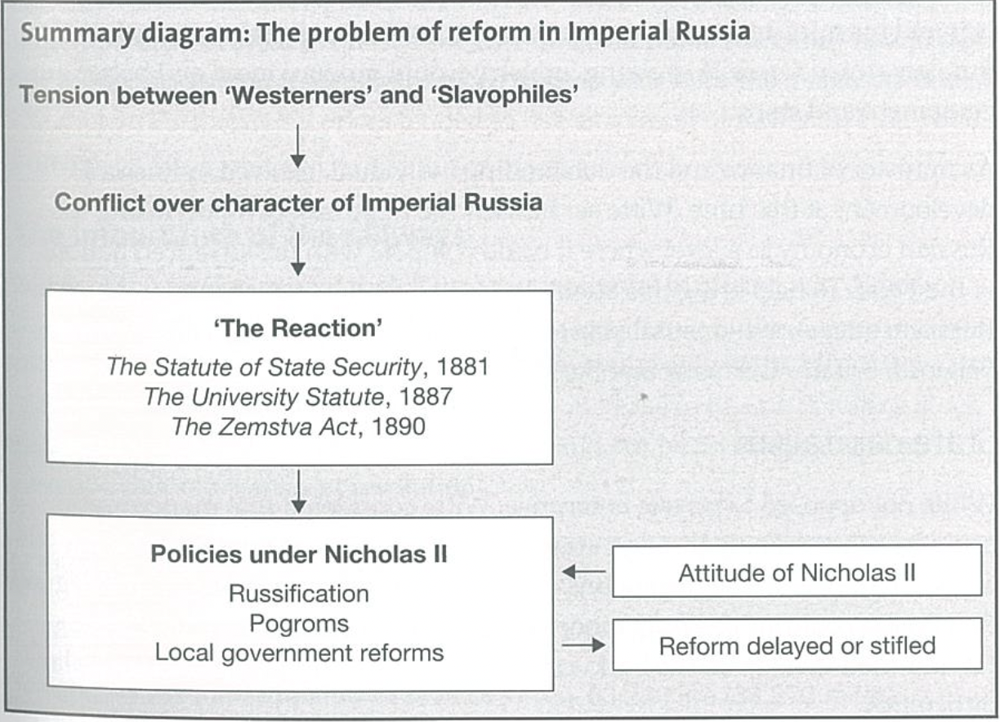

#history [[Key Features of the Russian Empire]]

# Problem of Reform in Russia
---

## Obstacles to reform

---

Many members of the ruling class accepted that major reforms were needed if Russia was to modernise its social and economic structure. However within the ruling class many disputes were held over petty thing that ultimately resulted in a lack of reform for Russia. 

- One major barrier to reform was a basic disagreement within the government elite over Russia’s true character as a nation. Since the days of Peter the Great there had been serious differences between ‘**Westerners who wanted to industrialise**’ and ‘**Slavophiles who wanted russia to stay the way it was really**’. Dispute made it difficult to achieve reform in an ordered and acceptable way.
- The autocratic structure of Russia itself was an obstacles change could only come from the top. There were no representative institutions such as a parliament. Many **progressive** Tsars accepted the need for reform yet none would implement any changes for fear of losing even the slightest bit of authority.

## Local Government Reform

---

- Emancipation of serfs in 1861 by Alexander II followed by setting up of a network of elected rural councils, known as ‘**zemstva**’ in 1864. Not truly democratic, did provide with some form of representative government.
- Valuable role played in the countryside by the **‘mir’**, which was a local organisation which would help to keep order and provide a cheap means of collecting taxes and mortgage repayments.

## Legal Reforms

---

- A number of legal reforms were introduced with the aim of simplifying the notoriously cumbersome court procedures whose delays had led to corruption and injustice.
- Greater Importance was given over to Alexander II’s relaxation of the controls over the press and the universities.
- Greater freedom of expression encouraged the development of an **‘intelligentsia’**.

 

## Limited Nature of the Reforms

---

Alexander II was not a supporter of reform for its own sake rather he saw it as a way of lessening opposition to the Tsarist system. He said that his intention was to introduce reform from above in order to prevent revolution from the below. Hoped that his reforms would attract the support of the intelligentsia. Emancipation, greater press and university freedoms, and the administrative and legal changes were greeted with enthusiasm by progressives. 

Fearful that he had gone too far, he abandoned his reformist policies and returned to the tsarist tradition of oppression that was continued by his successor Alexander III (1881—94) who became notorious for the severity of his rule. Implemented a series of restrictive measures known as ‘**The Reaction**’.

### Key Measures of ‘the Reaction’

---

*The Statute of State Security 1881*

- Special government controlled courts were set up, which operated outside the existing legal system.
- Judges, magistrates and officials who were sympathetic towards liberal ideas were removed from office.
- The powers of the Okhrana, the tsarist secret police, were extended, and censorship of the press was tightened.

At its introduction in 1881, this statute was described as temporary measure brought in to deal with an emergency, but in essentials it remained in place until 1917. 

*The University Statue 1887*

- Brought the universities under strict government control

*The Zemstva Act 1890*

- Decreased the independence of the local councils and empowered government officials to interfere in their decision making.

### Policies of Nicholas II

---

At a time when Russia needed a strong and powerful imaginative leader they were given with a man of weakness and limited outlook in Nicholas II. He seemed not to understand the real nature of the problems his nation and his dynasty faced. He continued the repressive policies he had inherited further angering the intelligentsia and the critics of the tsarist regime who began to prepare to challenge tsardom. 

### Role of Pobedonostsev

---

Tutored Nicholas II before he ascended to the throne as an arch conservative who had a deep distaste for all forms of liberalism and democracy. He dismissed the idea of representative government as ‘the great lie of our time’. To his mind autocracy was the only possible government for Imperial Russia. The Russians en masse were too uneducated, vulgar and uninformed to be able to govern themselves. He was behind many of the pogroms, part of the organised attempt to enforce religious conformity in Russia. 

## Russification

---

A severely enforced method of restricting the influence of the non-Russian national minorities within the empire by emphasising the superiority of all things Russian. Russian was declared to be the official first language; this meant all legal proceedings such as trials, and all administration had to be conducted in Russian. 

## Anti-Semitism

---

The greatest victims of Russification were the Jews. Over 600 new measures were introduced, imposing heavy social, political and economic restrictions on the Jewish population. Jews were required to live in discrete districts or **ghettoes.** This rendered them immediately identifiable and made it easy to characterise them as scapegoats blamed for Russia’s difficulties. Group of ultra-conservative Russian Nationalists, known as the ‘Black Hundreds’, were notorious for their attacks on Jews. 

