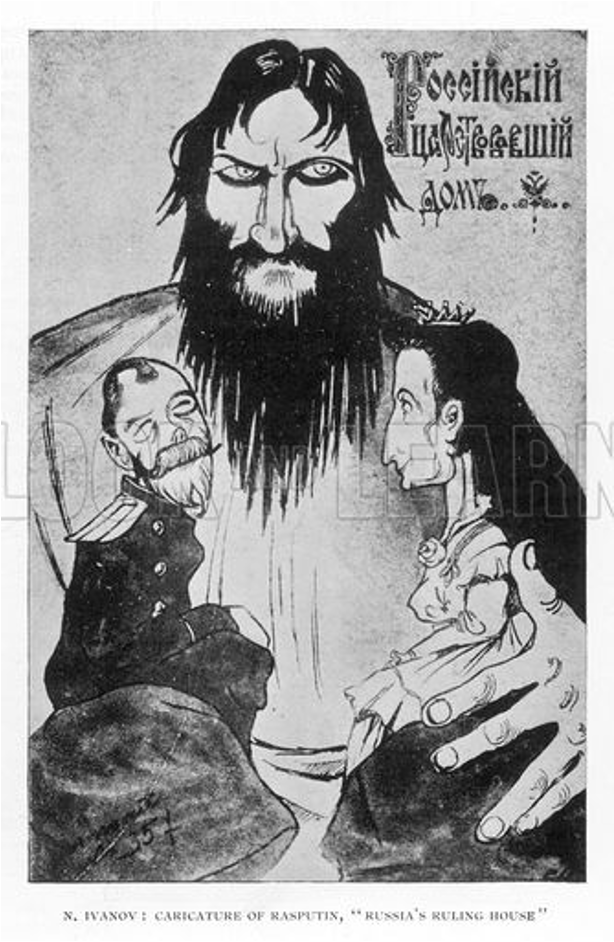

# Source Analysis

---

Using Source A and your own knowledge outline the role of Rasputin in the fall of the Romanov Dynasty

### Source A

Rasputin manipulated and tarnished the public image of the Romanov’s to the point where all it took was just one little step further to remove them from their rule. In Source A we can see Rasputin in the background as a menacing figure treating the Tsar and Tsarina as toys moving them around to where he wants them. This demonstrates the complete influence of Rasputin had over the Royal Family at the time and shows that the general public believed they were giving Rasputin his wishes. This is further accompanied by his sexual debauchery and rumours of an affair with the Tsar’s wife while Nicholas was away on his war campaign. These rumours were accentuated when the Tsarina became reliant upon Rasputin for advice after he “healed” her son of haemophilia by removing him from the services of the doctors. Due to his influence over the Tsar’s wife in a short span of 16 months Russia had 4 prime ministers, 3 ministers of war, 4 ministers of agriculture and three foreign secretaries contributed to Russia’s political instability. Ultimately, Rasputin contributed to the fall of the Romanov Dynasty by birthing a period of unrest and instability while tarnishing the reputation and public image of the Royal Family.