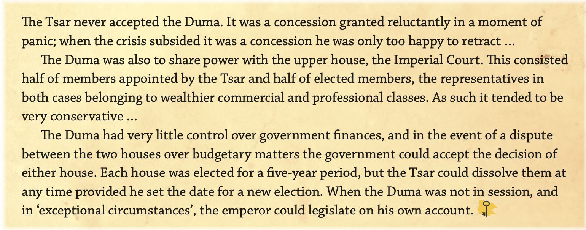

[[Romanov Dynasty]]

# The 1905 Revolution
---
### Crumbling Dynasty

---

> ***“What weakened the tsarist regime in the period before 1917 was its incompetence. It is certainly true that the crisis that occurred in Russia in 1905 was in large measure due to the mishandling of the situation by the Tsar and his government —** Lynch (2015)*
> 

## Challenge to the Tsar

---

The 1905 revolution symbolised the most serious challenge that the Romanov dynasty had faced. 

It was a direct political challenge to the Tsar from three main groups: 

- The Industrial Workers
- The Peasants
- The reformist middle class.

The 1905 revolution began with Father Georgy Gapon leading a peaceful march of workers and their families to the Winter Palace. 

- Wanted to present the Tsar with a petition and retrieve relief from their desperate conditions.
- The protesters were fired upon with estimates that over 200 were killed + 800 wounded.

> “*The general dissatisfaction of all classes with the government and their open hostility against it*”
> 

> *“Impossible to maintain this form of government except by violence”*
> 

> ***Leo Tolstoy — Open address to Nicholas II - 1902.***
> 

The immediate reaction was **widespread disorder** and violence throughout the Empire in 1905. It set in train a series of events that included strikes and rebellions. 

## Impact of Bloody Sunday

---

- Resulted in the first demonstration displaying the contempt the people held against the Tsar
- Gave rise to the 1905 revolution during which the number of strikes surpassed all those that were held beforehand
- Labour movement became more organised and Trade Unions started to appear even though they were illegal.
- 200 people were killed and over 800 were wounded.
- Widespread disorder and violence throughout the empire.
- new types of worker organisations, councils or worker representatives called **soviets** appeared for the first time

- Workers Unions began publishing their own papers completely ignoring the censorship laws that were in place.
- Formation of underground political groups → radicalisation.
- Army — Questioning their actions
- Reform.
- Disregard for laws and authority.
- Loss of legitimacy for the Tsar.

## Outline the Events of Bloody Sunday

---

Peaceful protest of 100,000 people led by Father Gapon a well respected member of the church asking for political changes. Once they reached the Winter Palace ended up being attacked by the Tsar’s soldiers while he was in another city. Approximately 200 people died and 800 more were wounded. Father Gapon survived and became an important figure. 

## Key Points — 1905 Revolution

---

- The 1905 Revolution was not coordinated revolution but a series of anti-tsarist strikes, protests and actions.
- Triggered by the January shootings in the capital, it began as general strikes imposed by industrial workers.
- This event broke the emotional/loyal bond between the Tsar and the people. Little Father → Bloody Nicholas.
- There was also political violence, such as the assassination of the tsar’s uncle Grand Duke Sergei.
- Other features of the revolution were military & naval mutinies and the formation of workers’ soviets (councils).
- The Tsar responded by promising a representative Duma but this was not done either promptly or sincerely.
- It is estimated that 15,000 people were killed and 70,000 arrested within a year. More than all other revolutionary activity combined.

[Lynch 31-38 Reading Questions](Lynch%20Questions%201905%20Revolution.md)

## The October Manifesto

---

- Nicholas II reluctantly made concessions due to ongoing unrest. He promised:
    - Free Speech
    - An elected assembly — The Duma
- As the unrest quelled, Nicholas II appeared unwilling to enforce the promised reform.
    - Released the **Fundamental Laws** which reinforced his full autocratic powers.
    - “**Supreme autocratic power belongs to the Tsar.**”

> *If I were convinced that Russia wanted me to abdicate my autocratic powers, I would do that for the country’s good. But I am not convinced this is so, and I do not believe that there is need to alter the nature of my supreme power. It is dangerous to change the way that power is formulated. I know, too, that if no change is made, this may give rise to agitation, to attacks. But where will these attacks come from? From so-called educated people, for the proletariat , from the Third Estate? Actually, I feel that eight per cent of the people are with me.* 
**— From the Tsar’s Statement, April 1906**
> 

- Played into what the Kadets and Octobrists wanted from the tsar.
- As Russia was paralysed by the 1905 Revolution, there were widespread demands for political reform and widespread fears that tsarism might be toppled.
- In February 1905, Nicholas agreed to consider proposals for the formation a State Duma, an elected body to participate in government and law-making.

- The first proposal, a Duma elected on a limited franchise(a certain set of people that agreed with his interests), was widely rejected and stimulated further unrest among the Russian people.
- In October, the tsar agreed to a more expansive set of political reforms, albeit after his suggestions for military repression were ignored.
- The October Manifesto promised the introduction of a State Duma elected by all Russians, along with improvements to individual civil and legal rights.

### A historian’s view

---

> *“Whether or not you see the October Manifesto as a genuine policy of conciliation, or an attempt to ‘buy off’ the revolutionary movement, it served to split the opposition. It proved too much for conservatives and too little for the Social Democrats, who continued with their agitation... Liberals were also divided between ‘moderates’ who professed satisfaction with the concessions and ‘progressives’ (Kadets) who continued to demand further parliamentary reforms.”*
**— David Welch**
> 

## The Dumas

---

An elected body representing the minority restricted to landowners. 

Powers limited to a small part of the budget. 

It could be dissolved at any time by the Tsar had the power of veto to overrule any decision. 

Made up of two chambers: elected and appointed. 

## Tasks

---

**Read p.102-104.** 

1. *Describe the key promises made by the Tsar.*
    
    The Tsar promised to provide the citizens with a legislative Duma that would allow the people to make some sort of rules and laws for themselves and have a say in the countries actions and all Russian men from all classes were allowed to be a part of the elections. The legalisation of Political Parties and the right of free speech were also promised made by Nicholas II. 
    
2. *Explain how the duma failed to provide real political power to the Russian people.* 
    
    The Duma was split up into two chambers, one elected and the other appointed, this ensured that while the people were still given some form of control and authority it wasn’t always enough to overrule the votes of those Nicholas had placed in the Duma himself whose values aligned with him. Furthermore, the elected body representing the minority was restricted to landowners further reducing the number of changes that could be made to aid the common man. Lastly, Nicholas held the right to veto any decision made by the duma essentially making it useless in the form of making changes as anything that might counter his rule was dismissed immediately.  
    

## Click-bait/Tokenistic

### To what extent was the Tsar’s unwavering belief in autocracy responsible for the fall of the Romanovs?

---

- Large/Consequential Extent, Significant Extent.
- Resulted in his ignorance of the challenges faced by the everyday Russian due to his rules/laws which ultimately led to his own downfall and refusal to look beyond what he knew in his life at the palace.
- It also led to a lack of trust between the Tsar and his people as the rest of Europe moved on to a constitutional monarchy with a seperate assembly and way for the people to make their own laws.
- Living in his own fantasy world, detached from reality and what it actually means to live as a actual person.
- Led to his removal and death.

## Tsar’s Inefficiencies

---

**The Russo-Japanese War**

→ Underestimated the Japanese’s capacity for war and their efficiency and being able to mobilise. 

→ Instead of acknowledging the problems present in the country at the time he decided to go to war to distract himself and the people from their current situation. 

→ Arrogant in assuming that he would easily crush this “tiny” nation in east Asia. 

**The 1905 Revolution**

→ Failed to correctly respond to the people’s peaceful ask for basic rights and civil liberties. 

→ His detachment from reality and the unrest amongst the people of Russia. 

→ He’s not very independent and just left it to his military officials.

**The October Manifesto and Duma’s**

→ Showed how he was unable to shed even a single drop of his control over the population to the people. 

→ Gave false hope to his people once realised resulted in further radicalisation. 

→ Again detachment from reality and the fact that his people wanted real change and not the false change he gave them. 

## Source Analysis

---

1. Outline the perspective of the source
    
    The source comes from the point of view of shared by two historians looking back at the actions of the tsar during a time of conflict. 
    
2. In what ways could this source be considered useful to a historian?
    
    This source can be considered useful to a historian as it outlines the reasons for reluctancy to fully implement the Duma and how he had its control limited by keeping the power to dissolve it any given time. It also gives us information about the structure of the Duma and how the elections were held making it useful to a historian. 
    

1. Assess the reliability of this source:
    
    This source is reliable as it provides us with  information about the nature of The Duma and the tsar’s unwillingness to let it have any sort of real control over the decisions made by the government. It is also not biased.